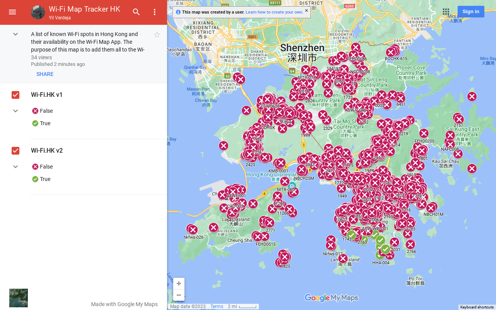

# Hong Kong Wi-Fi Map Tracker 
Adding known Wi-Fi hotspots in Hong Kong into the [Wi-Fi Map App](https://www.wifimap.io/).

## Progress Tracking ([See Map](https://www.google.com/maps/d/edit?mid=1JradRQ7CZG6hzKbUb-7-b2jMTAjiK1M&usp=sharing))

## Contribution
To contribute, add any of the remaining Wi-Fi Hotspots into the Wi-Fi map app. Once complete, make a pull request with changes to the "WiFi Map" header within the [wifi-map-hk.csv](https://github.com/yilverdeja/wifi-map-tracker-hk/blob/main/wifi-map-hk.csv).

## Remaining Wi-Fi Hotspots
See the [wifi-map-hk.csv](https://github.com/yilverdeja/wifi-map-tracker-hk/blob/main/wifi-map-hk.csv) for a full list of all known hotspots in Hong Kong. The list below only shows the remaining Wi-Fi hotspots that haven't been added to the WiFi Map App.
<!-- The line under this comment should be blank. If this README is updated, and the line number is not the same as before, then the github action  to write into the README must also be fixed to match it. -->
**Total:** 2983

**Added:** 41 (1.37%)

**Not Added:** 2942 (98.63%)
